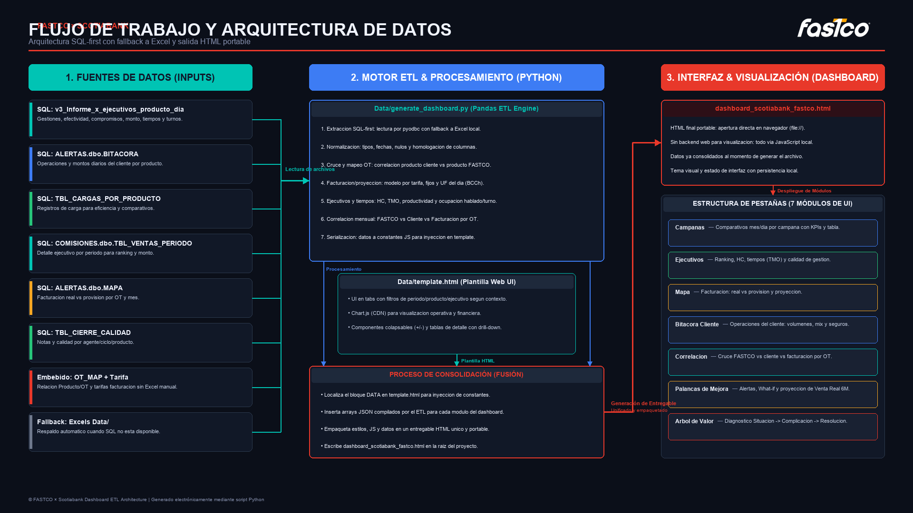

# FASTCO x Scotiabank - Dashboard Operacional

Dashboard ejecutivo-operacional para seguimiento de productividad, gestion comercial, bitacora cliente, facturacion y correlaciones para la cuenta Scotiabank.

## 1) Objetivo

El proyecto genera un entregable HTML unico y portable (`dashboard_scotiabank_fastco.html`) a partir de multiples fuentes de datos. El dashboard no requiere servidor para visualizarse y se abre directamente en navegador.

## 2) Arquitectura (SQL-first)

La logica actual prioriza lectura desde SQL Server y mantiene fallback a Excel cuando la conexion SQL no esta disponible.

Flujo resumido:
1. Extrae datos desde SQL Server (si hay conectividad/driver).
2. Si una fuente falla, usa archivo local equivalente en `Data/`.
3. Normaliza y agrega metricas en Python (`Data/generate_dashboard.py`).
4. Inyecta constantes JS en `Data/template.html`.
5. Genera `dashboard_scotiabank_fastco.html` en la raiz.

## 3) Estructura del repositorio

```
.
├── Data/
│   ├── generate_dashboard.py
│   └── template.html
├── create_flow_diagram.py
├── flujo_operacional_scotiabank.png
├── dashboard_scotiabank_fastco.html
├── LOGO1.png
└── README.md
```

## 4) Inputs del ETL

### 4.1 Fuentes SQL principales

`Data/generate_dashboard.py` consulta principalmente:
- `ALERTAS.dbo.BITACORA`
- `PCVMEZA.QFASTCO_INFORMES.dbo.TBL_CIERRE_CALIDAD`
- `BASE_CARGAS.DBO.TBL_CARGAS_POR_PRODUCTO`
- `BASE_REPORTES.dbo.v3_Informe_x_ejecutivos_producto_dia`
- `COMISIONES.dbo.TBL_VENTAS_PERIODO`
- `ALERTAS.dbo.MAPA`

### 4.2 Fallback locales (cuando SQL no responde)

En `Data/`, el script puede usar:
- `DATA_HISTORIA_DETALLE.xlsx`
- `BITACORA.xlsx`
- `CARGAS.xlsx`
- `DETALLE_EJECUTIVO.xlsx`
- `FACTURACION_PROVISIONES.xlsx`
- `CALIDAD.xlsx`

### 4.3 Inputs embebidos en codigo

Se eliminaron dependencias manuales para:
- `RELACION_BITACORA_OT.txt` (hoy embebido como `OT_MAP_EMBEDDED`)
- `MODELO_FACTURACION.xlsx` (tarifas embebidas en `FACT_PROY_TARIFFS`)

## 5) Variables de entorno SQL

Variables soportadas:
- `SCOTIA_SQL_SERVER` (default: `192.168.100.136`)
- `SCOTIA_SQL_DATABASE` (default: `ALERTAS`)
- `SCOTIA_SQL_CONNECTION_STRING` (opcional; si existe, tiene prioridad)

El script prueba drivers ODBC compatibles y utiliza trusted connection.

## 6) Stack tecnologico

- Python 3.11+
- pandas
- numpy
- pyodbc (SQL Server)
- openpyxl (fallback Excel)
- requests (UF API)
- prophet (opcional, para una de las metodologias de proyeccion)
- Frontend: HTML + CSS + JavaScript + Chart.js (CDN)

## 7) Como ejecutar

Desde la raiz del proyecto:

```powershell
& ".\.venv\Scripts\python.exe" .\Data\generate_dashboard.py
```

Salida esperada:
- Archivo generado/actualizado: `dashboard_scotiabank_fastco.html`
- Mensajes de estado por cada bloque de carga

## 8) Pestañas del dashboard

El dashboard expone 7 pestañas (etiqueta visible -> vista interna):

- Campanas (`campanas`)
- Ejecutivos (`ejecutivos`)
- Mapa (`facturacion`) - facturacion y crecimiento historico
- Bitacora Cliente (`bitacora`)
- Correlacion (`correlacion`)
- Palancas de Mejora (`oportunidades`)
- Arbol de Valor (`minto`)

Notas funcionales recientes:
- Filtro de periodo: en todas las pestañas (incluida Calidad dentro de Ejecutivos) los meses se ordenan de forma descendente, con el mes mas actual arriba y el mas antiguo abajo.
- Filtro de campaña (Palancas de Mejora y Arbol de Valor): las opciones se muestran como "Todas las campañas / Avance / Refinanciamiento / TDC", sin el sufijo "(monto)/(unidades)".
- Campanas: en "Comparativo Cargas por Mes" existe filtro desplegable por campana (Todas/Avance/Refinanciamiento/TDC) y el grafico se recalcula al cambiar seleccion.
- Campanas: el filtro de campana del bloque de Cargas esta sincronizado con el filtro de campana compartido de los comparativos de Gestion.
- Terminologia: el factor del embudo antes llamado "Materializacion" se muestra como "Venta real / Compromisos".
- Encabezados de Palancas de Mejora y Arbol de Valor reescritos con una descripcion de proposito (que hace cada pestaña y como leerla).
- Campanas: en los comparativos "Gestion por Mes" y "Gestion por Dia" la seleccion de KPI es single-select.
- Campanas: cada grafico comparativo incluye una tabla lateral con Actual, Anterior y Prom. 3M.
- Ejecutivos: el selector de TOP10 se recalcula segun periodo y campaña activos; para TDC el ranking usa cantidad de compromisos.
- Ejecutivos: existe un bloque separado de "Cuartilizacion Mensual por Ejecutivo" que clasifica por mes con filtros activos; para TDC usa solo compromisos y para el resto combina compromisos y monto.
- Arbol de Valor: diagnostico ejecutivo Situacion -> Complicacion -> Resolucion embebido, con descomposicion de palancas del embudo (waterfall).

## 9) Logica funcional clave

- Correlacion: cruza FASTCO, cliente y facturacion por producto/OT y mes.
- Ejecutivos: ranking dinamico por filtros, headcount, tiempos (incluyendo conversion robusta de unidad para `TURNO`) y cuartilizacion mensual por ejecutivo.
- Facturacion: mezcla historico + proyeccion en base a UF y series de actividad.
- Campanas: comparativos mensuales y diarios con filtros globales y tabla lateral de lectura rapida.
- Bitacora: seguimiento mensual y diario sobre la fuente BITACORA.
- Minto: capa de lectura ejecutiva resumida dentro del HTML final.

## 10) Diagrama de arquitectura

El diagrama se genera con:

```powershell
& ".\.venv\Scripts\python.exe" .\create_flow_diagram.py
```

Archivo de salida:
- `flujo_operacional_scotiabank.png`



## 11) Mantenimiento

- Si cambias logica visual o de componentes, editar `Data/template.html` y luego regenerar.
- Si cambias logica ETL o fuentes, editar `Data/generate_dashboard.py`.
- Mantener sincronizados `README.md` y `create_flow_diagram.py` cuando cambie la arquitectura.
